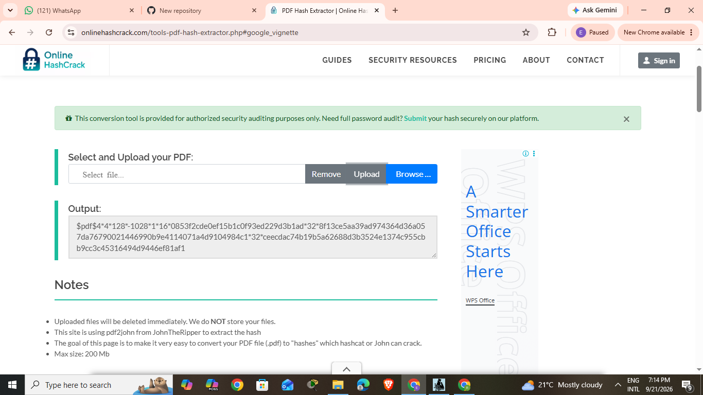
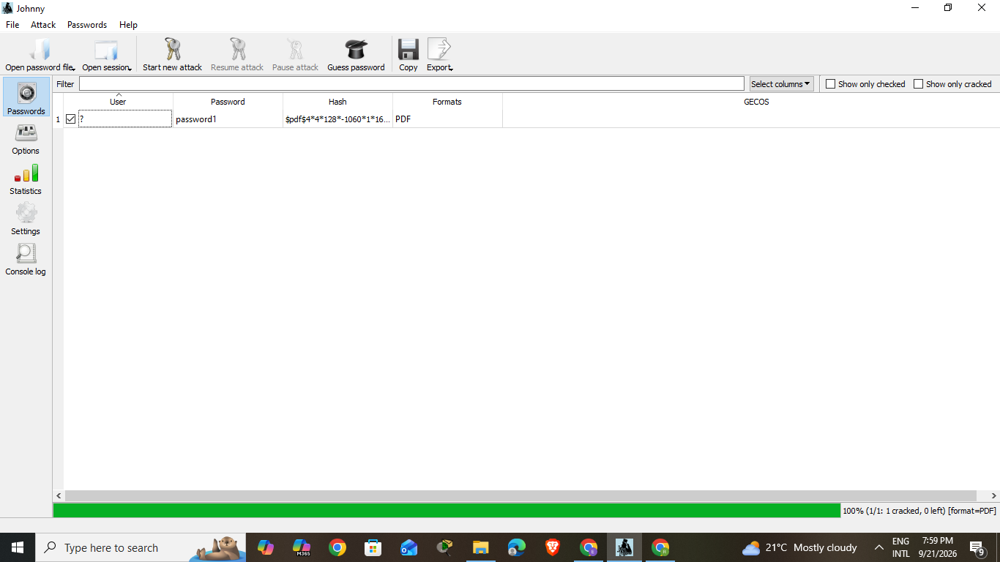
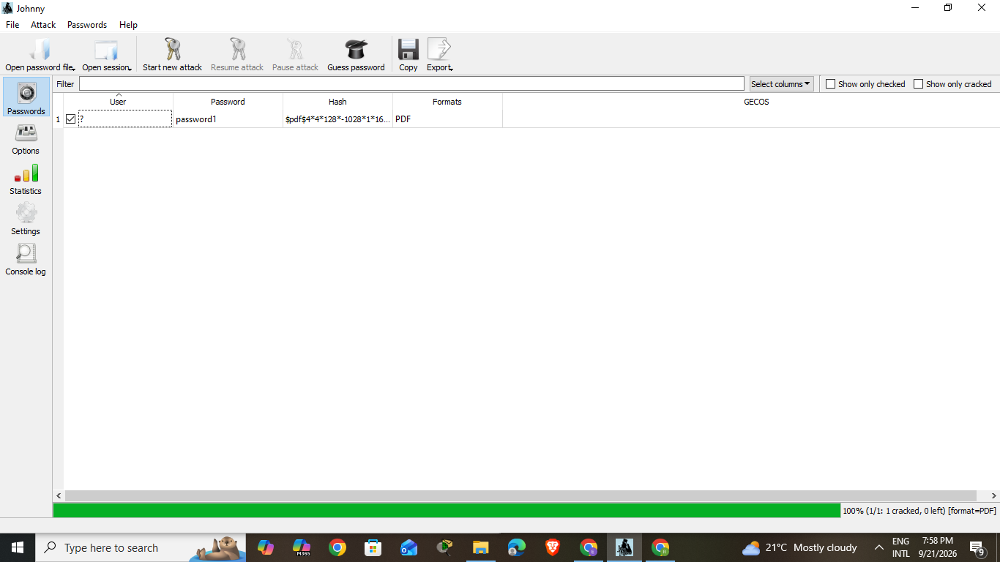
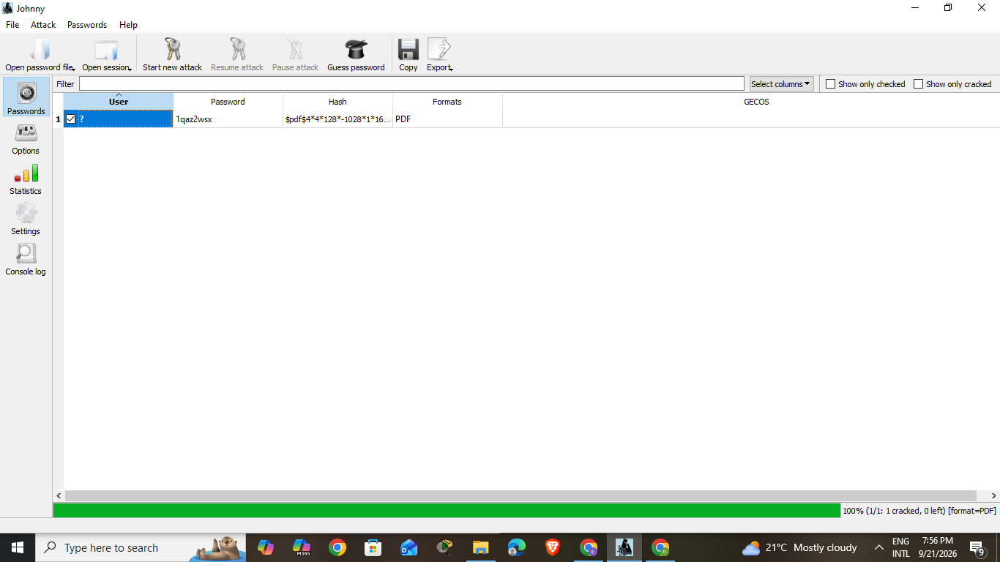
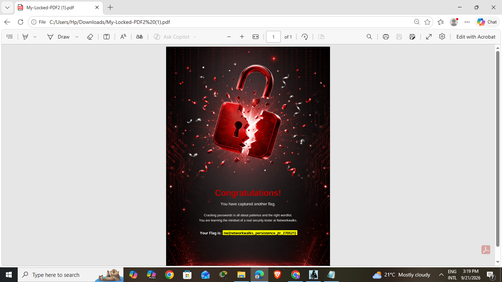
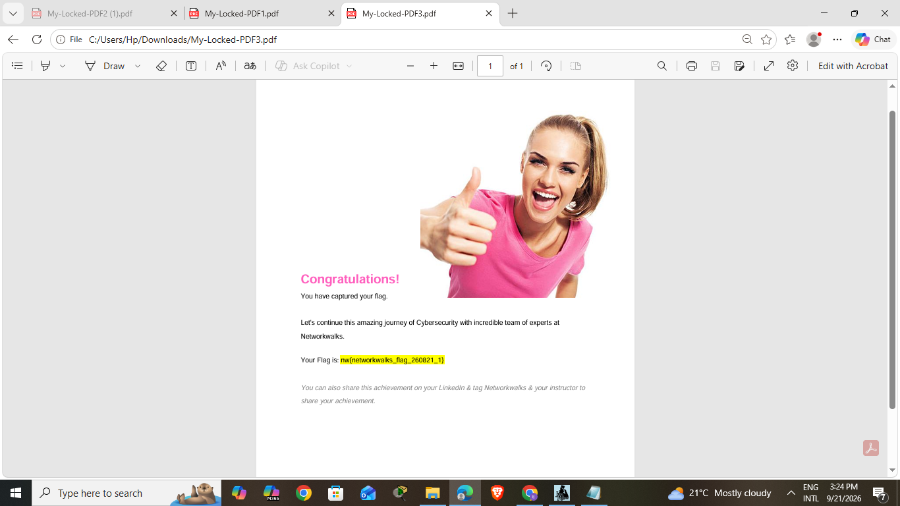
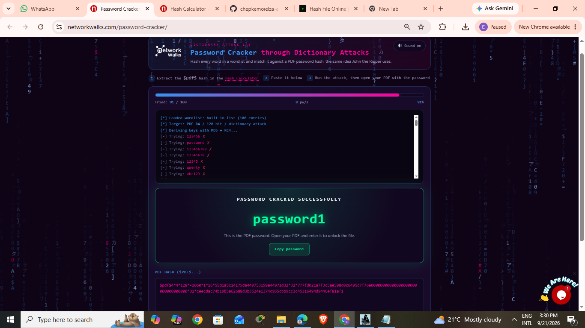
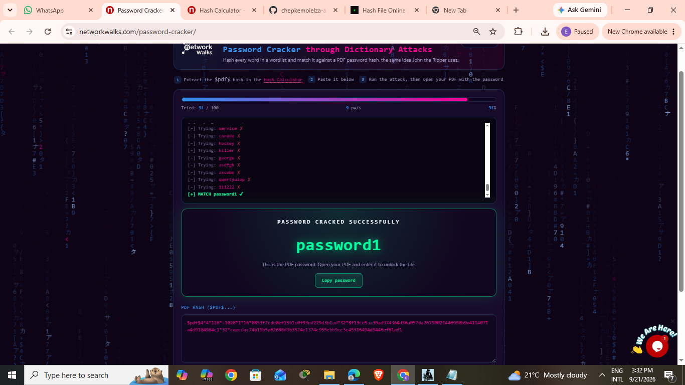
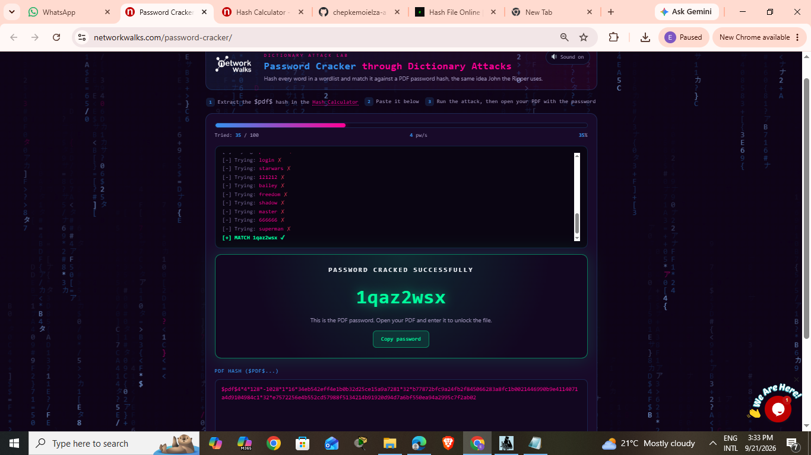

# Networkwalks Cybersecurity Internship – Week 3

**Author:** Elza Chepkemoi  
**Batch:** B083D  
**Institution:** Networkwalks  
**Week:** 03 – Password Cracking (Modules W3-PM1 & W3-PM2)

---

## Project Overview

This repository contains the final deliverable for **Week 3** of the Networkwalks Cybersecurity Internship.

Two practical modules were completed:

| Module  | Title                                       | Tools Used                                      |
|---------|---------------------------------------------|-------------------------------------------------|
| W3-PM1  | Password Cracking with JTR                  | John the Ripper (Jumbo) + Johnny GUI            |
| W3-PM2  | Password Cracking with Networkwalks Tools   | Hash Calculator + Password Cracker (browser)    |

All activities were performed **only** on the lab-provided locked PDF files, under the authorization of the internship program.

---

## Repository Structure

```
├── README.md
├── hash1extractor.png
├── hash2extractor.png
├── hash3extractor.png
├── mypdf1cracked.png
├── mypdf2cracked.png
├── mypdf3cracked.png
├── mylockedfile1opened.png
├── mylockedfile2opened.png
├── mylockedfile3opened.png
├── networkwalksfile1attack.png
├── networkwalksfile2attack.png
└── networkwalksfile3attack.png
```

---

## W3-PM1 — John the Ripper (JTR) + Johnny GUI

### Workflow

1. Download **John the Ripper Jumbo** and **Johnny GUI** from openwall.com.
2. Extract the `$pdf$` hash from the locked PDF using either:
   - **`pdf2john.pl`** (JTR Jumbo) or **onlinehashcrack.com** → produces the `…1060…` variant
   - **Networkwalks Hash Calculator** → produces the `…1028…` variant
3. Save the hash to `hash1.txt` (must start with `$pdf$`).
4. Open Johnny → **Open password file** → select `hash1.txt`.
5. Click **Start new attack** (Johnny uses a built-in wordlist by default).
6. Once cracked, open the PDF and enter the recovered password.

### JTR Command-Line Equivalent

```bash
# Extract hash
pdf2john.pl My-Locked-PDF1.pdf > hash1.txt

# Crack
john --wordlist=/usr/share/wordlists/rockyou.txt hash1.txt

# Show result
john --show hash1.txt
```

### Results — W3-PM1 (Johnny GUI)

| PDF File            | Cracked Password | Flag Captured                            | Evidence |
|---------------------|------------------|------------------------------------------|----------|
| My-Locked-PDF1.pdf  | `password1`      | `nw{networkwalks_flag1_jtr_270521_1}`    | `mypdf1cracked.png`, `mylockedfile1opened.png` |
| My-Locked-PDF2.pdf  | `password1`      | `nw{networkwalks_flag1_jtr_270521_1}`    | `mypdf2cracked.png`, `mylockedfile2opened.png` |
| My-Locked-PDF3.pdf  | `1qaz2wsx`       | `nw{networkwalks_flag_260821_1}`         | `mypdf3cracked.png`, `mylockedfile3opened.png` |


---

## W3-PM2 — Networkwalks Browser Tools

### Workflow

1. Open **Networkwalks Hash Calculator**:  
   https://networkwalks.com/hash-calculator/
2. Upload the locked PDF → the tool extracts the `$pdf$` hash locally in your browser.
3. Copy the full `$pdf$` hash.
4. Open **Networkwalks Password Cracker**:  
   https://networkwalks.com/password-cracker/
5. Paste the hash → click **Start Cracking** (dictionary attack, built-in 100-word list).
6. The tool reports the password — open the PDF and enter it.

### Results — W3-PM2 (NW Browser Tools)

| PDF File            | Cracked Password | Evidence |
|---------------------|------------------|----------|
| My-Locked-PDF1.pdf  | `password1`      | `networkwalksfile1attack.png` |
| My-Locked-PDF2.pdf  | `password1`      | `networkwalksfile2attack.png` |
| My-Locked-PDF3.pdf  | `1qaz2wsx`       | `networkwalksfile3attack.png` |

---

## Master Results — Week 3 Password Cracking

| PDF File            | Johnny (W3-PM1) | NW Tool (W3-PM2) | Flag Captured                            |
|---------------------|-----------------|------------------|------------------------------------------|
| My-Locked-PDF1.pdf  | `password1` ✅  | `password1` ✅   | `nw{networkwalks_flag1_jtr_270521_1}`    |
| My-Locked-PDF2.pdf  | `password1` ✅  | `password1` ✅   | `nw{networkwalks_flag1_jtr_270521_1}`    |
| My-Locked-PDF3.pdf  | `1qaz2wsx` ✅   | `1qaz2wsx` ✅    | `nw{networkwalks_flag_260821_1}`         |

---

## Visual Evidence

### 1. Hash Extraction

**PDF1 hash extractor**


**PDF2 hash extractor**



**PDF3 hash extractor**


---

### 2. Johnny GUI — Cracked Passwords

**PDF1 → cracked (`password1`)**



**PDF2 → cracked (`password1`)**



**PDF3 → cracked (`1qaz2wsx`)**



---

### 3. Flags Captured

**PDF1 opened → `nw{networkwalks_flag1_jtr_270521_1}`**


**PDF2 opened → `nw{networkwalks_flag1_jtr_270521_1}`**



**PDF3 opened → `nw{networkwalks_flag_260821_1}`**



---

### 4. Networkwalks Password Cracker

**File 1 attack → `password1`**



**File 2 attack → `password1`**



**File 3 attack → `1qaz2wsx`**



---

## Key Takeaways

- **Weak / common passwords are cracked in seconds** using dictionary attacks.  
  `password1` and `1qaz2wsx` are classic examples of passwords that appear in every
  default wordlist.
- **Offline (Johnny/JTR) and online (Networkwalks) toolchains recovered identical
  passwords**, confirming the attack surface is the same regardless of delivery
  method.
- **Two of the three lab PDFs shared the same password and flag** — a strong
  reminder that reusing credentials across files/systems amplifies the impact of
  a single crack.
- **Hash extraction ≠ hashing.** PDF passwords are stored as *encryption + hash*;
  `pdf2john` / NW Hash Calculator convert the encryption parameters into a
  crackable `$pdf$` format.
- **Strong, unique passwords remain the most effective defense.** A 12+ character
  mixed-case + symbol + number password would make this dictionary attack infeasible.

---

## Disclaimer

All activities documented in this report were performed strictly within the
**authorized scope** of the Networkwalks Cybersecurity Internship (Batch B083D),
against **lab-provided files only**.

These materials are for **educational and research purposes only**.  
Unauthorized password cracking against systems or files you do not own is
**illegal** and unethical.

---

**Author:** Elza Chepkemoi  
**Batch:** B083D  
**Institution:** Networkwalks  
**Week:** 03
